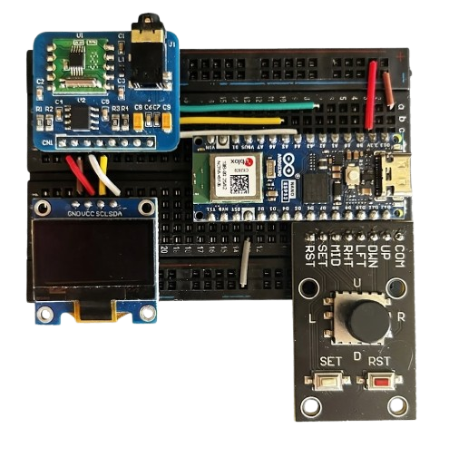
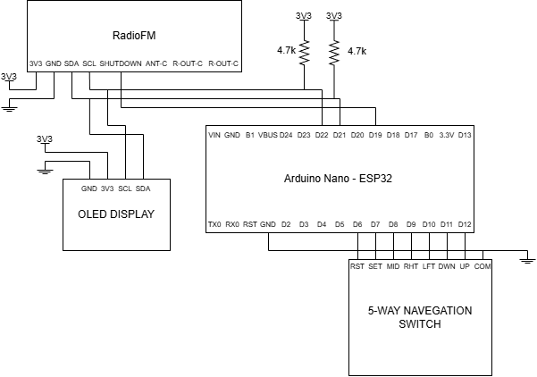

# FM Radio Receiver



Recetor de rádio FM com controlo digital, desenvolvido como Projeto Final de Curso (PFC) em Engenharia Eletrónica e Telecomunicações e de Computadores no ISEL. O sistema é baseado num **Arduino Nano ESP32** e no módulo **RDA5807M**, e permite sintonia manual (joystick + display OLED) ou remota, através de um dashboard em **Python** com visualização em tempo real da intensidade de sinal (RSSI).

---

## Features

- Sintonia manual (joystick + OLED) e remota (dashboard Python via UART)
- Controlo de volume e mute
- Scan total (80–108 MHz) e scan centrado (±10 passos)
- Visualização em tempo real do RSSI por frequência
- Exportação de gráficos (PNG) e dados de scan (TXT)

---

## Diagrama de Blocos



---

## Hardware Utilizado

| Componente | Função |
|---|---|
| Arduino Nano ESP32 | Microcontrolador principal |
| RDA5807M | Módulo recetor de rádio FM |
| Display OLED SSD1306 | Interface visual local |
| Joystick + botões | Controlo manual local |
| Amplificador PAM8403 / TPA6111A2 | Amplificação de áudio |
| DS3231 | Módulo de relógio em tempo real (RTC) |

Datasheets completos disponíveis em [`docs/`](docs).

---

## Estrutura do Repositório

```
fm-radio-receiver/
├── README.md
├── Doxyfile               # Configuração do Doxygen
├── firmware/              # Firmware C/C++ para o Arduino Nano ESP32
├── software/              # Dashboard Python (fm_scanner.py)
├── docs/
│   ├── mainpage.md        # Página principal da documentação Doxygen
│   └── images/            # Foto do circuito e diagrama de blocos
├── reports/               # Relatórios (inicial, progresso, final) e posters
└── media/                 # Fotos dos componentes e testes realizados
```

---

## Como Usar

1. Fazer upload do firmware presente em [`firmware/`](firmware) para o Arduino Nano ESP32.
2. Ligar o Arduino ao PC via USB.
3. Correr o dashboard Python:
   ```bash
   python software/fm_scanner.py
   ```
4. Controlar o rádio (frequência, volume, scans) através do dashboard ou do joystick físico.

---

## Documentação Técnica

A documentação técnica completa do código (gerada com Doxygen, incluindo diagramas UML de classes e de sequência) está publicada em:
**[santosjoaop.github.io/fm-radio-receiver](https://santosjoaop.github.io/fm-radio-receiver/)**

Relatórios completos do projeto (inicial, de progresso e final) e posters científicos estão disponíveis em [`reports/`](reports).

---

## Autoria

**Autor:** João Pedro Santos
**Instituição:** ISEL — Instituto Superior de Engenharia de Lisboa
**Curso:** Engenharia Eletrónica e Telecomunicações e de Computadores
**Ano letivo:** 2025/2026

**Orientador:** Prof. Vítor Fialho, Ph.D.

**Júri:**
| Arguente | Prof. Mestre Especialista Luís Miguel Rego Pires|
| Presidente | Prof. Doutor Fernando Manuel Ascenso Fortes |
|Orientador|Prof. Doutor Vítor Manuel de Oliveira Fialho |
---

## Licença

Projeto disponibilizado para fins académicos e de consulta. Para reutilização, contactar o autor.
